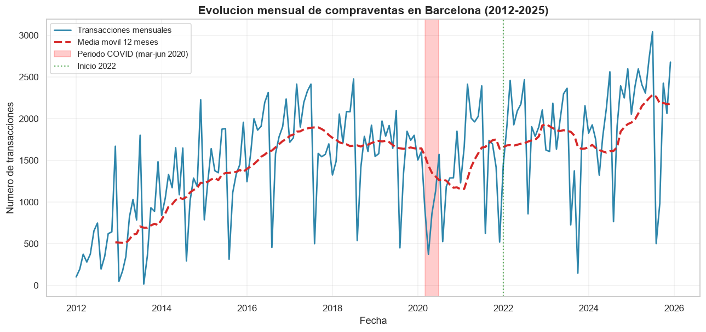
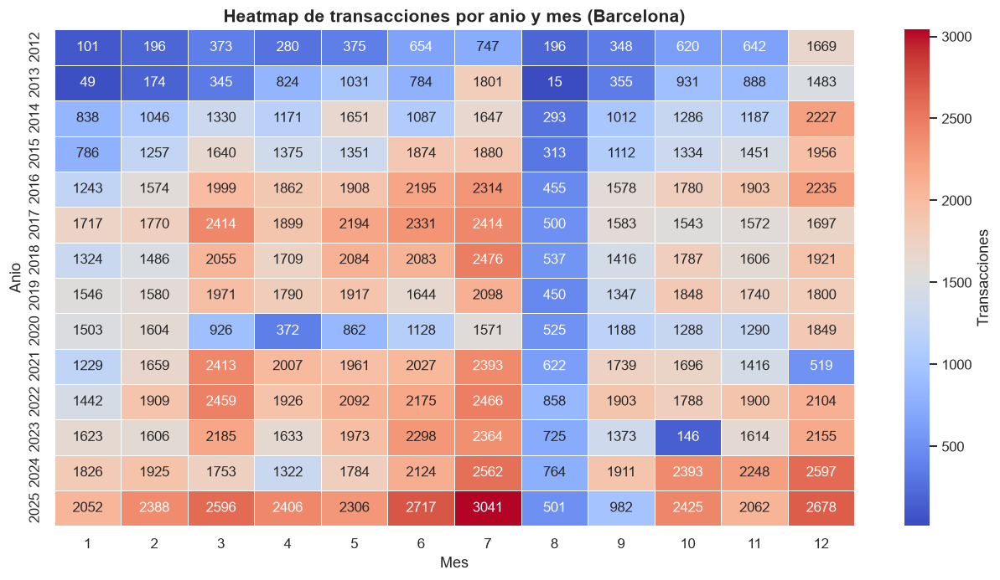
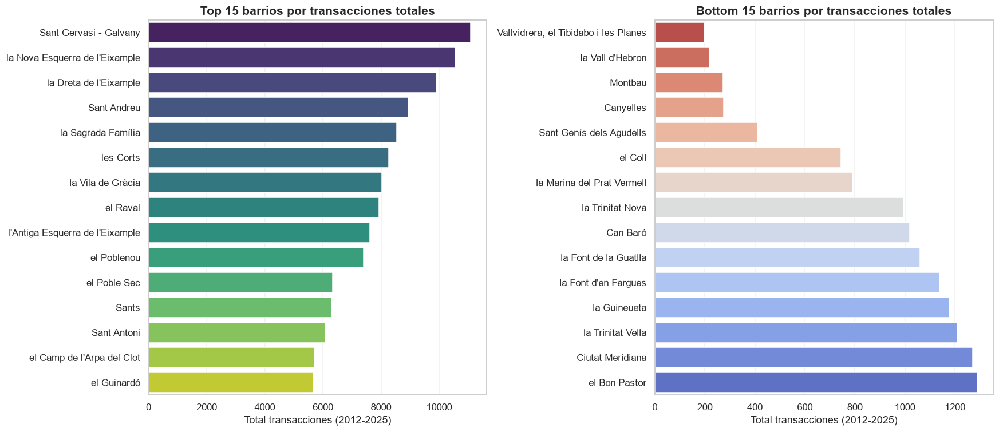
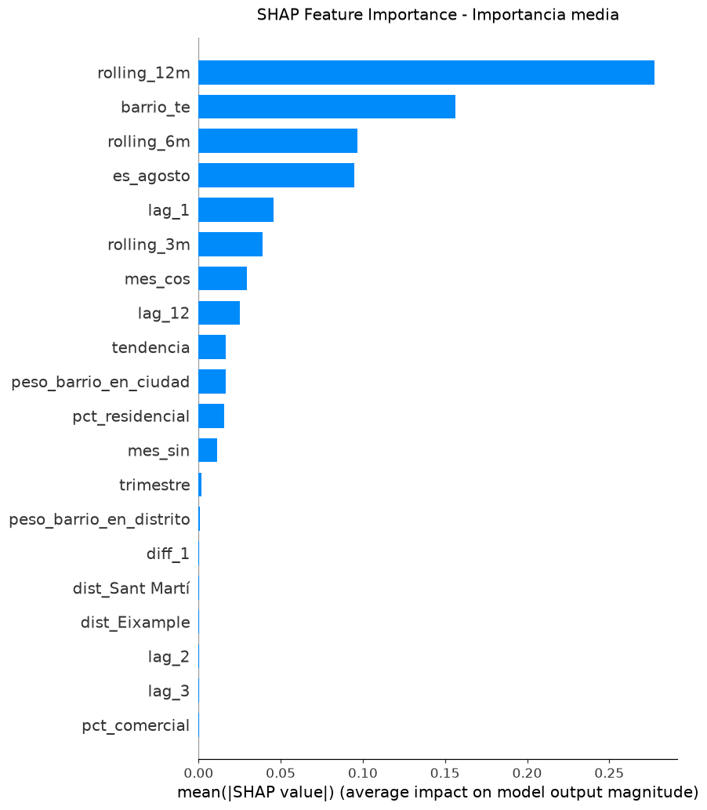
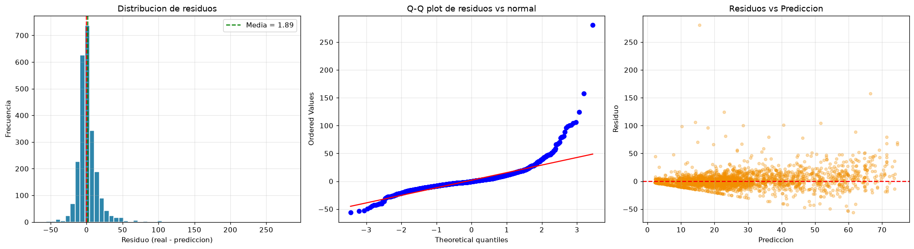

# 🏘️ Predicción de Transacciones Inmobiliarias en Barcelona

[](https://prediccion-vivienda-bcn.netlify.app)
[](https://www.python.org/)
[](https://pandas.pydata.org/)
[](https://scikit-learn.org/)
[](https://xgboost.readthedocs.io/)
[](https://shap.readthedocs.io/)
[](https://matplotlib.org/)
[](https://seaborn.pydata.org/)
[](LICENSE)
[]()

> **Reto 5 — Business Intelligence y Big Data | Curso 6 | Odisea Data**
>
> Modelo predictivo del número de transacciones inmobiliarias mensuales por barrio en Barcelona, con interpretabilidad vía SHAP y análisis complementario de alquiler (SERPAVI) y población extranjera (Padrón).

---

## 🎯 Objetivo

Construir un **modelo predictivo** del número de transacciones inmobiliarias mensuales por barrio en Barcelona, aplicando:

- **Análisis descriptivo** del mercado inmobiliario (2012–2025)
- **Modelado predictivo** con XGBoost (objetivo Poisson)
- **Interpretabilidad** vía SHAP
- **Análisis complementario**: alquiler (SERPAVI) y población extranjera (Padrón Municipal)

---

## 🏆 Resultados principales

| Métrica | Valor |
|---|---|
| **Modelo final** | XGBoost (objetivo Poisson) |
| **R² en test** | **0,617** |
| **RMSE en test** | 15,77 transacciones |
| **MAE en test** | 9,26 transacciones |
| **MAPE** | 36,7% |
| **Dataset** | 68 barrios × 167 meses (2012–2025) |
| **Transacciones analizadas** | 254.732 |

**Comparativa con baseline**:

| Modelo | RMSE | R² |
|---|---|---|
| Dummy (media) | 26,53 | −0,08 |
| Ridge (baseline) | 15,82 | 0,615 |
| **XGBoost (final)** | **15,77** | **0,617** |

---

## 💡 Hallazgos clave

1. **Ciclo completo 2012–2025**: crisis, recuperación, COVID y máximos históricos.
2. **La tendencia histórica del barrio** es el factor más predictivo (`rolling_12m` con 23,7% del impacto SHAP).
3. **El alquiler NO predice transacciones** (correlación nula, r = −0,07).
4. **La población extranjera es mayoritariamente inquilina** (70,5%).
5. **El modelo subestima picos extremos** (>100 transacciones).

---

## 🌐 Dashboard interactivo

**Ver resultados en vivo**: 👉 [prediccion-vivienda-bcn.netlify.app](https://prediccion-vivienda-bcn.netlify.app)

Galería navegable con las **26 visualizaciones** del proyecto organizadas por temática: EDA, Modelado, SHAP, análisis SERPAVI y análisis de extranjeros.

---

## 📊 Fuentes de datos

| Fuente | Uso | Granularidad |
|---|---|---|
| [datos.gob.es](https://datos.gob.es) (Notariado) | Fuente principal | Barrio × mes × tipología |
| SERPAVI (Ministerio de Vivienda) | Análisis de alquiler | Distrito (agregable a barrio) |
| Padrón Municipal 2024 | Análisis de extranjeros | Distrito |

---

## 🛠️ Stack tecnológico

<p align="center">
  
  
  
  
  
  
  
</p>

| Categoría | Tecnologías |
|---|---|
| **Lenguaje** | Python 3.13 |
| **Datos** | pandas, NumPy |
| **ML clásico** | scikit-learn (Ridge, Lasso, TimeSeriesSplit) |
| **Modelo final** | XGBoost (objetivo Poisson) |
| **Interpretabilidad** | SHAP |
| **Visualización** | Matplotlib, Seaborn |
| **Presentaciones** | python-pptx |

---

## 📁 Estructura del proyecto

```
reto5_precios_vivienda_cataluna/
│
├── data/
│   ├── raw/                          # Datos originales (Notariado, SERPAVI)
│   ├── interim/                      # Datos consolidados
│   └── processed/                    # Datasets listos para modelar
│
├── notebooks/                        # Exploración (Jupyter)
│
├── src/
│   ├── ingesta/                      # Carga y consolidación
│   ├── preparacion/                  # Agregación y filtrado
│   ├── analisis/                     # EDA y análisis complementario
│   ├── modelado/                     # Feature engineering, baseline, XGBoost, SHAP
│   ├── presentacion/                 # Generación de PPTX
│   └── utilidades/                   # Config, logger
│
├── models/                           # Modelos ligeros (JSON, CSV)
│   ├── xgboost_final.json
│   ├── xgboost_metricas.json
│   └── feature_importance.csv
│
├── reports/
│   ├── figuras/                      # 26 visualizaciones PNG
│   ├── documentacion/                # 6 documentos del proyecto
│   ├── presentacion/                 # 2 presentaciones PPTX
│   └── metricas/                     # Tablas comparativas CSV
│
├── docs/                             # Decisiones metodológicas
├── requirements.txt
├── LICENSE
└── README.md
```

---

## 📚 Documentación

| # | Documento | Descripción |
|---|---|---|
| 01 | [Definición del problema](reports/documentacion/01_definicion_problema.md) | Business problem y objetivos |
| 02 | [Fuentes de datos](reports/documentacion/02_fuentes_datos.md) | Notariado, SERPAVI, Padrón |
| 03 | [Preparación de datos](reports/documentacion/03_preparacion_datos.md) | Pipeline de 5 fases |
| 04 | [Análisis exploratorio](reports/documentacion/04_analisis_exploratorio.md) | EDA con 8 figuras |
| 05 | [Modelado y evaluación](reports/documentacion/05_modelado_evaluacion.md) | Baseline + XGBoost + SHAP |
| 06 | [Conclusiones y recomendaciones](reports/documentacion/06_conclusiones_recomendaciones.md) | Recomendaciones por perfil |

**Documentos adicionales**:
- [Decisiones metodológicas](docs/decisiones_metodologicas.md)
- [Autoevaluación del reto](docs/autoevaluacion.md)

---

## 📸 Visualizaciones destacadas

### Serie temporal (2012–2025)



### Estacionalidad (heatmap año × mes)



### Ranking de barrios



### SHAP Feature Importance



### Análisis de residuos



> **26 visualizaciones completas** disponibles en `reports/figuras/`

---

## 📊 Presentaciones

Dos presentaciones ejecutivas en formato PowerPoint:

| Presentación | Slides | Descripción | Descarga |
|---|---|---|---|
| **1. Metodología** | 14 | Pipeline técnico, decisiones metodológicas, corrección de data leakage | [Descargar PPTX](reports/presentacion/presentacion_1_metodologia.pptx) |
| **2. Resultados** | 17 | Hallazgos del EDA, análisis SERPAVI, modelo final, SHAP, recomendaciones | [Descargar PPTX](reports/presentacion/presentacion_2_resultados.pptx) |

> **Nota**: las presentaciones incluyen **audio narrado** en cada slide. Para escucharlo, descarga el archivo `.pptx` y ábrelo en **PowerPoint**.

---

## 🚀 Reproducibilidad

### 1. Clonar el repositorio

```bash
git clone https://github.com/jdthgp27/reto5-precios-vivienda-cataluna.git
cd reto5-precios-vivienda-cataluna
```

### 2. Crear entorno virtual

```bash
python -m venv venv
source venv/Scripts/activate   # Windows (Git Bash)
# source venv/bin/activate     # macOS / Linux
```

### 3. Instalar dependencias

```bash
pip install -r requirements.txt
```

### 4. Ejecutar pipeline completo

```bash
python src/ingesta/reparar_csv_notariado.py
python src/ingesta/cargar_notariado.py
python src/preparacion/agregar_notariado_barcelona.py
python src/preparacion/filtrar_barrios.py
python src/modelado/01_feature_engineering.py
python src/modelado/02_baseline.py
python src/modelado/03_xgboost.py
python src/modelado/04_evaluacion.py
python src/modelado/05_shap.py
```

**Tiempo total**: menos de 5 minutos.

---

## 📦 Entregables del reto

- [x] **1. Código y scripts documentados** → [src/](src/)
- [x] **2. Documentación completa** → [reports/documentacion/](reports/documentacion/)
- [x] **3. Visualizaciones** → [reports/figuras/](reports/figuras/)
- [x] **4. Presentación ejecutiva** → [reports/presentacion/](reports/presentacion/)

---

## 🔄 Trabajo futuro

1. **Integrar Idescat**: añadir población y renta por barrio como features.
2. **Integrar SERPAVI a nivel de barrio**: calcular la elasticidad alquiler–compraventa.
3. **Modelo hurdle (zero-inflated)**: mejorar la predicción de picos extremos.
4. **Expandir a Madrid y otras ciudades**: replicar el pipeline con datasets equivalentes.

---

## 👤 Autora

**Judit Giravent Pineda**

- GitHub: [@jdthgp27](https://github.com/jdthgp27)
- LinkedIn: [linkedin.com/in/judit-giravent-27b167156](https://linkedin.com/in/judit-giravent-27b167156)
- Email: jdthgp27@gmail.com

---

## 📜 Licencia

Este proyecto está bajo la **Licencia MIT**. Consulta el archivo [LICENSE](LICENSE) para más detalles.

---

*Proyecto académico · Odisea Data · 2025*

---

⭐ Si este proyecto te ha resultado útil, considera darle una estrella en GitHub.